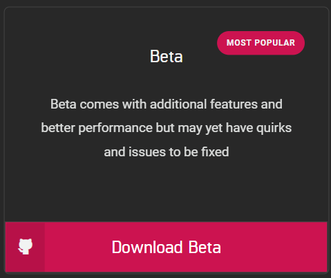
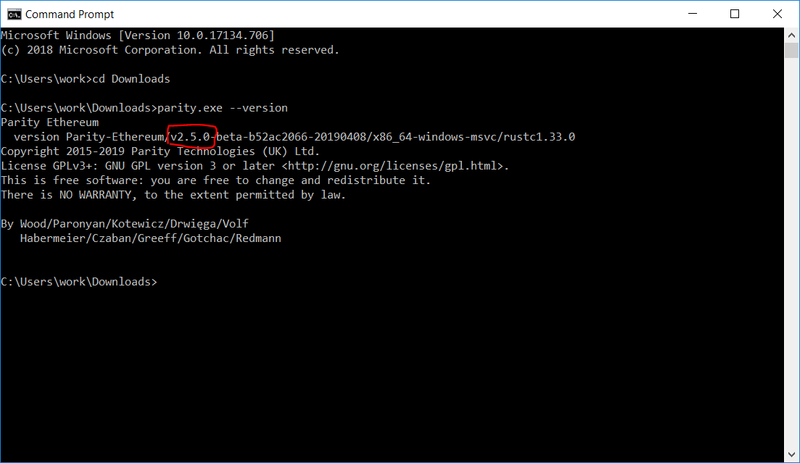
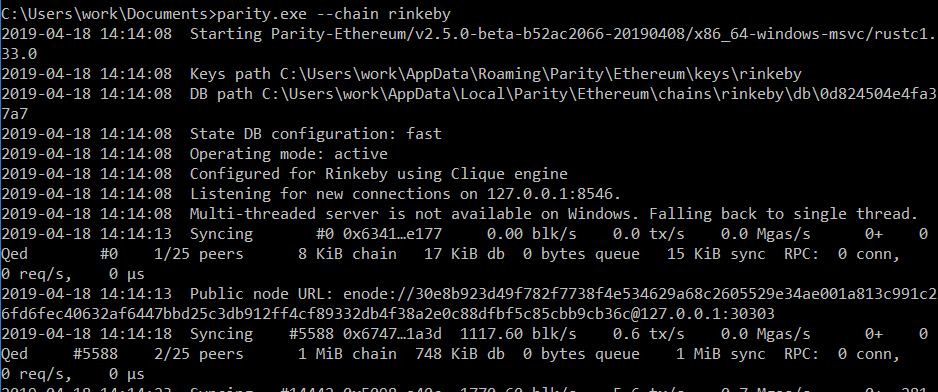

# Module 4 - Intermediate Lab: Creating a full node with the Parity framework

## Background


## Meta Information
| Attribute | Explanation |
| - | - |
| Summary | This assignment involves creating a full node for the Rinkeby testnet using Parity v2.5.0 |
| Topics  | Parity, testnet, Rinkeby, full node |
| Audience | Appropriate for CS1 or a later course. |
| Difficulty | Intermediate. |
| Strengths | The student will learn how to host a full node of their own. |
| Weaknesses | Parity requires interfacing with a command prompt. |
| Dependencies | Machine running Windows OS, internet connection |
| Variants | There are other Parity-compatible software that works on top of it, which may be covered in another lab. |

## Assignment Instructions
1. Parity should be downloaded from [Parity.](Parity) Make sure to download the beta version of Parity (v2.5.0+) as it allows the creation of a full node for testnetworks like Rinkeby.




2. Open a command prompt by holding the Windows key and pressing R. Then type in "cmd." and press enter. You should see a black window pop up, we will be using it to execute parity.exe that was downloaded earlier.
	* Sidenote, "cd" is a command to change the active directory of the command prompt. By default, it opens at the root of your user directory. We used it in this case to go into our Downloads folder. If your browser downloads files elsewhere, give a full path such as `cd C:\Users\YourUsername\Somefolder\Someotherfolder`




3. Execute parity with --version just like in the above screenshot to make sure that you are using the correct version. We are looking for v2.5.0 and above.
4. We are going to execute Parity with a flag to sync with the [Rinkeby testnet.](Rinkeby) The command is:
```
parity.exe --chain rinkeby
```




## Credits
Dr. Debasis Bhattacharya  
Mario Canul  
Saxon Knight  
https://github.com/ethereumbook/ethereumbook  

[Remix]: https://remix.ethereum.org
[Parity]: https://www.parity.io/ethereum/#download
[Rinkeby]: https://www.rinkeby.io 